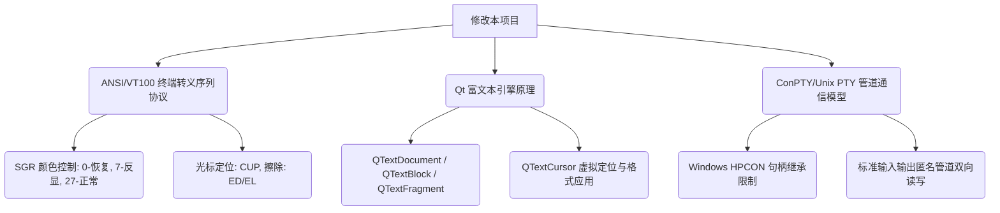

# 项目交接与经验知识库 (qt-terminal-widget)

为了让后续接手本项目的开发人员或 Agent 能够无缝开展工作，本文总结了本项目在光标渲染、自动折行、背景白条等调试开发中汲取的底层经验、代码库中的“隐形规则”、必须具备的前置知识，以及后续开发的接手指南。

---

## 1. 汲取的工程经验与 Root Cause 总结

在解决此项目的各种显示 Bug 过程中，我们深入分析并总结了以下底层机制的根源：

### 💡 物理光标与虚拟反显光标的共存冲突
* **现象**：由于物理光标（文本框自带的闪烁竖线）和软件模拟光标（反显方块）并存，界面显得极其混乱。
* **错误尝试**：试图通过 Qt 样式表（QSS）修改 `caret-color` 隐藏物理光标，但 Qt 6 的 QSS 并**不支持**此 CSS 属性，强行写入会报未知属性警告。
* **Root Cause 与方案**：Qt 的物理光标前景色直接关联到 `QPalette::Text` 颜色。我们在 [terminalwidget.cpp](file:///F:/B_My_Document/GitHub/qt-terminal-widget/src/terminal/terminalwidget.cpp) 的 `syncCursor()` 中，通过 `QPalette::Text` 临时设为 `Qt::transparent`（透明）彻底隐形了硬件光标。
* **关键衍生问题**：物理光标变透明后，由于普通字符也默认使用 `QPalette::Text` 颜色，会导致终端里输出的常规文字也全部隐形。
* **最终解法**：在 [ansiparser.cpp](file:///F:/B_My_Document/GitHub/qt-terminal-widget/src/terminal/ansiparser.cpp) 解析非反显文本时，强制显式指定文字前景色（如亮灰色 `QColor(220, 220, 220)`），确保它们不会退回到透明的默认 Palette 上。

### 💡 满行悬挂折行 (DECAWM) 的临界判断
* **现象**：窗口“最大化再还原”后，输入提示符被拼接到上一行的行尾，或者超出最大边界被物理截断。
* **Root Cause**：Windows ConPTY 在输出分隔线等满行字符时**不会**主动下发换行符（`\r\n`），它默认终端软件会自动折行。
* **最终解法**：在 `writeTextSegmentInternal` 和 `writeSingleCharString` 阶段，输入字符时实时检查光标逻辑列是否已达到极限列数 `m_cols`。如果达到，则在当前位置强制执行“折行逻辑”（即虚拟光标下移一行，列宽归零，平移视口），以模拟标准 VT 终端的悬挂折行行为。

### 💡 擦除删除导致背景出现“白条”
* **现象**：按退格（Backspace）删除文字、或者清行清屏时，被删除的位置留下大片反显白块。
* **Root Cause**：Qt 的 `QTextCursor` 在插入空白字符（用于擦除或退格补白）时，如果没有显式指定字符格式，默认会**隐式继承**上一个字符或光标所在位置的 `QTextCharFormat`（包括我们刚才渲染虚拟反显光标时使用的 `m_inverted` 翻转标志），从而将填充的空格全部画成了白底黑字的反显背景。
* **最终解法**：在执行所有退格、擦除、清行（如 `eraseLine`、`eraseLineFromCursor`）操作填充补齐空格时，强制显式应用一个干净、默认初始化的空 `QTextCharFormat()`，彻底切断格式继承。

---

## 2. 项目中的“隐形规则” (Hidden Rules & Gotchas)

在对该项目进行后续重构或修改时，务必遵守以下底层的物理和逻辑隐形约束：

> [!WARNING]
> ### 1. 不要依赖 QTextBlock::text().length() 换算物理列宽！
> 由于终端中可能包含汉字、全角符号、以及经过 Qt 字体拉伸（`fontStretch`）的缩放字符，一个字符在逻辑网格上可能占用 2 列或不规则列宽。
> * **正确做法**：使用我们已重构的高精度定位函数 [blockDisplayWidth](file:///F:/B_My_Document/GitHub/qt-terminal-widget/src/terminal/terminalwidget.cpp) 和 `blockColumnToCharIndex`。它们会遍历 `QTextBlock::iterator` 里面的 `QTextFragment` 并根据 stretch 属性加权计算实际渲染出的网格列宽。

> [!IMPORTANT]
> ### 2. 擦除与坐标系是逻辑抽象，不是物理字符删除
> 终端中的“擦除”和“删除”与普通文本编辑器的 `backspace` 不同：
> * 终端的删除大部分只是**在对应网格坐标写入空白占位符（空格）**并向前移动光标。
> * `TerminalWidget` 必须保证每一行都被补齐到 `m_cols` 列宽以维持网格矩形，不要试图物理删除 QTextBlock 里的行，这会导致视口跳跃和错位。

> [!NOTE]
> ### 3. 编译隔离原则 (Out-of-source Build)
> * 项目的编译必须在独立的 `build/` 文件夹中进行（例如 `cmake -B build`），绝对不允许在项目根目录下直接运行生成中间文件的编译命令，以防止源码目录被 `.obj` / `.o` / `Makefile` 等污染。

---

## 3. 修改本项目必备的前置知识

下一个接手的开发者或 Agent，在开始写代码前必须先掌握以下领域知识：

1. **ANSI / VT100 终端转义协议**：
   * 需要知道控制字符的含义，例如 `\u001b[H`（移动到行首）、`\u001b[2J`（清屏）、`\u001b[7m`（反显，SGR 7）、`\u001b[27m`（取消反显，SGR 27）等。
   * 控制流由 [ansiparser.h](file:///F:/B_My_Document/GitHub/qt-terminal-widget/src/terminal/ansiparser.h) 统一拦截解析，它不负责绘图，只向 `TerminalWidget` 发送状态改变信号。
2. **Qt 富文本引擎架构**：
   * 需理解 `QTextDocument` 是基于段落（`QTextBlock`）和块内片段（`QTextFragment`）嵌套的树状结构。
   * 需要熟练掌握 `QTextCursor` 的行为：它的移动（`movePosition`）是基于字符偏移的，而终端的行为是基于 `(Row, Col)` 网格坐标的。二者之间的映射是本项目的核心难点。
3. **Pty 通信模型**：
   * 在 Windows 下，ConPTY 的读端和写端管道在多线程阻塞模型下的生存周期管辖。任何对 I/O 管道的关闭都必须优雅地结束阻塞中的 `ReadFile` 线程（可通过 `requestInterruption()` 和提前 CloseHandle 读端管道来强行唤醒）。

---

## 4. 后续 Agent 接手指南

如果您是新接手本项目的 Agent，可以按照以下路线快速理解并推进剩余工作：

1. **第一步：环境验证与测试**
   * 项目已内置了主测试入口 [src/main.cpp](file:///F:/B_My_Document/GitHub/qt-terminal-widget/src/main.cpp)。
   * 在 `build` 目录下直接使用 CMake 编译并运行，即可弹出一个嵌入了本地 Shell (cmd/powershell) 的 Qt 窗口，可以直接在里面打字并观察折行、退格、清行行为。
2. **第二步：定位关键代码文件**
   * **转义状态机**：[ansiparser.cpp](file:///F:/B_My_Document/GitHub/qt-terminal-widget/src/terminal/ansiparser.cpp) —— 解析来自 PTY 管道的原始 ANSI 数据，驱动文本属性和光标位置转换。
   * **渲染与排版核心**：[terminalwidget.cpp](file:///F:/B_My_Document/GitHub/qt-terminal-widget/src/terminal/terminalwidget.cpp) —— 核心的富文本网格控制、字符写入、删除、高精度光标同步所在文件。
   * **管道进程封装**：[conptyprocess.cpp](file:///F:/B_My_Document/GitHub/qt-terminal-widget/src/pty/conptyprocess.cpp) —— 处理 Windows 原生 ConPTY 的生命周期及 I/O 线程读写。
3. **第三步：待完善的遗留任务建议**
   * **鼠标追踪支持（Mouse Tracking）**：目前项目尚未完整捕获并转发鼠标点击/滚轮事件（如在终端运行 `htop` / `Midnight Commander` 时通过鼠标点击菜单）。可后续在 `TerminalWidget::mousePressEvent` 中编码对应的 ANSI 鼠标报告序列（如 `\u001b[M...`）并写入进程管道。
   * **高亮选择改进**：由于我们隐藏了系统的物理光标，用鼠标在 `TerminalWidget` 里拉拽选择文本时的背景反色高亮显示仍需与我们的虚拟光标做视觉协调。

---

## 5. 补充架构设计要点与避坑指南 (Architecture Details & Pitfalls)

为了确保后续改动不破坏已有的系统稳定性，请在开发时严格遵守以下架构设计与并发原则：

> [!CAUTION]
> ### 1. 多线程与 Qt UI 线程独占限制（核心并发规则）
> 底层 PTY 数据的读取在独立子线程中进行（如 [conptyprocess.cpp](file:///F:/B_My_Document/GitHub/qt-terminal-widget/src/pty/conptyprocess.cpp) 的后台读取 Loop），而终端渲染使用的是 `QTextDocument` 与 `QTextCursor`。
> * **绝对禁忌**：**严禁在后台读取线程中直接调用任何 UI 操作或操作 QTextDocument / QTextCursor！** Qt 限制非 GUI 线程访问 GUI 资源，否则会导致瞬间崩溃或随机死锁。
> * **正确做法**：通过 `PtyBuffer`（加锁互斥保护）缓存数据，在主线程中使用 Qt 的 `readyRead` 信号槽机制接收字节，将渲染排版操作完全局限在 GUI 主线程中执行。

> [!TIP]
> ### 2. 状态机流式解析与调试日志（AnsiParser Trace）
> `AnsiParser` 是流式字节解析器。如果后续遇到特殊的转义字符（例如下划线、双线、隐藏）显示不正确，可在 `AnsiParser::parse` 内部调用 `toggleTrace()` 或添加调试输出。由于 PTY 返回的数据可能是拼包或断包，任何复杂的字符控制状态必须确保是**可增量持久化存储**的，避免每次解析时覆盖未完成的 ANSI 控制标志。

> [!NOTE]
> ### 3. 历史行重新排列（Reflow）的架构选型建议
> 目前当窗口尺寸缩放（Resize）时，我们虽然向 ConPTY 报告了新的网格大小，但没有执行完整的历史字符重新排版（Reflow）。
> * 如果后续要实现完整的 Reflow（即拉大窗口时原本折行的文字自动拼回一行，收缩窗口时历史文字重新排满折行）：
>   - **建议不要使用 QTextDocument 原生的折行！** 这会导致终端字符坐标定位无法预测。
>   - **推荐方案**：由 C++ 端自行实现一个与渲染分离的二维字符网格缓冲区（Character Grid Buffer）。每次 Resize 后，重新计算内存缓冲区中的物理折行坐标，然后再把排好版的字符串全量重写回 `QTextDocument`。
